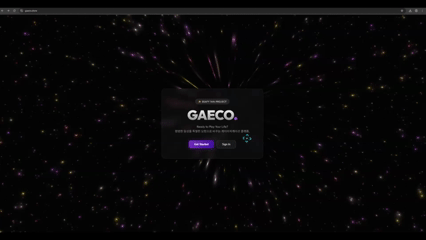
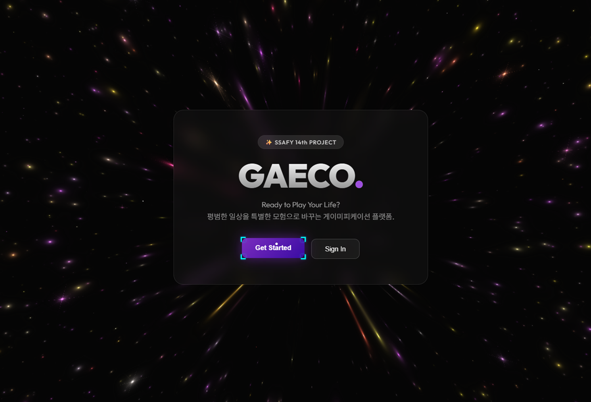
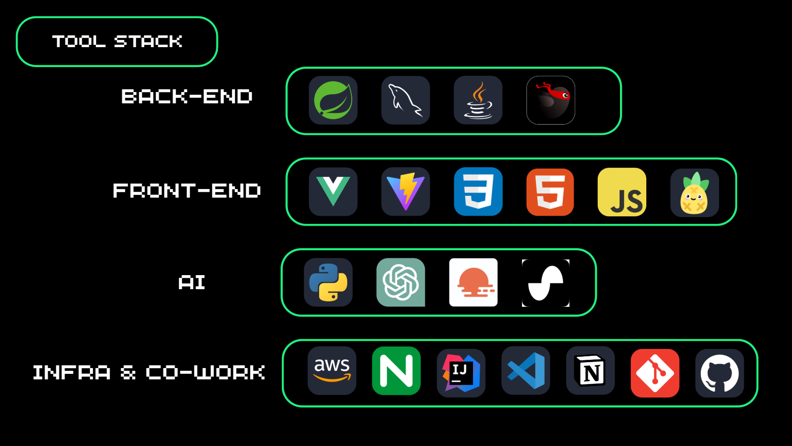
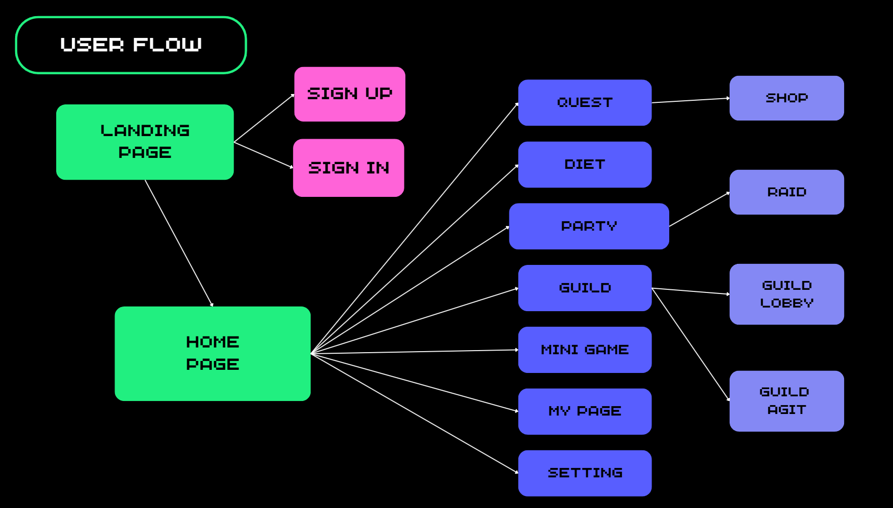

# 🎮 GAECO : Gamified AI Eco-system
> **"게이미피케이션 기반 자기계발 플랫폼"**

> 

## 📅 프로젝트 소개
**GAECO**는 건강 관리(식단, 운동)에 RPG 게임 요소와 실시간 메타버스를 결합하여 지속 가능한 동기를 부여하는 웹 서비스입니다.
사용자는 AI 비서의 도움을 받아 간편하게 식단을 기록하고, 길드원들과 실시간 아지트에서 소통하며 함께 성장할 수 있습니다.

* **개발 기간:** 2025.11.25 ~ 2025.12.24 (약 4주)
* **개발 인원:** 2명 

---

## 📸 프로젝트 메인 이미지

---

## 👨‍💻 팀원 소개

| Role | Name |  Github |
|:---:|:---:|:---:|
| **Leader** | **박지원**  | [@username](https://github.com/) |

| **Member** | **신현성**  | [@username](https://github.com/) |

---

## ✨ 기능 소개 (Key Features)

---

## 🏗️ 시스템 아키텍처 (System Architecture)

* **Backend:** Spring Boot 기반의 REST API 서버 및 WebSocket 메시지 브로커 구축.
* **Frontend:** Vue 3 Composition API와 Pinia 상태 관리, Phaser 3 게임 엔진 활용.
* **AI/Data:** Python 프로세스 연동을 통한 이기종 언어 간 통신 구현.
* **Infra:** AWS EC2, Docker, Jenkins를 활용한 CI/CD 파이프라인 구축.

---

## 🛠️ 기술 스택 (Tech Stack)

---
## 📡 User Flow 

## 📚 프로젝트 산출물
* 📑 [요구사항 정의서 및 다이어그램](https://rift-lily-9b7.notion.site/2ab43ea273fc81eca8e8c1a852d9dd25?pvs=73)
* 🎨 [Convention](https://rift-lily-9b7.notion.site/2d243ea273fc81b691f8fd7a807117b1)
---

